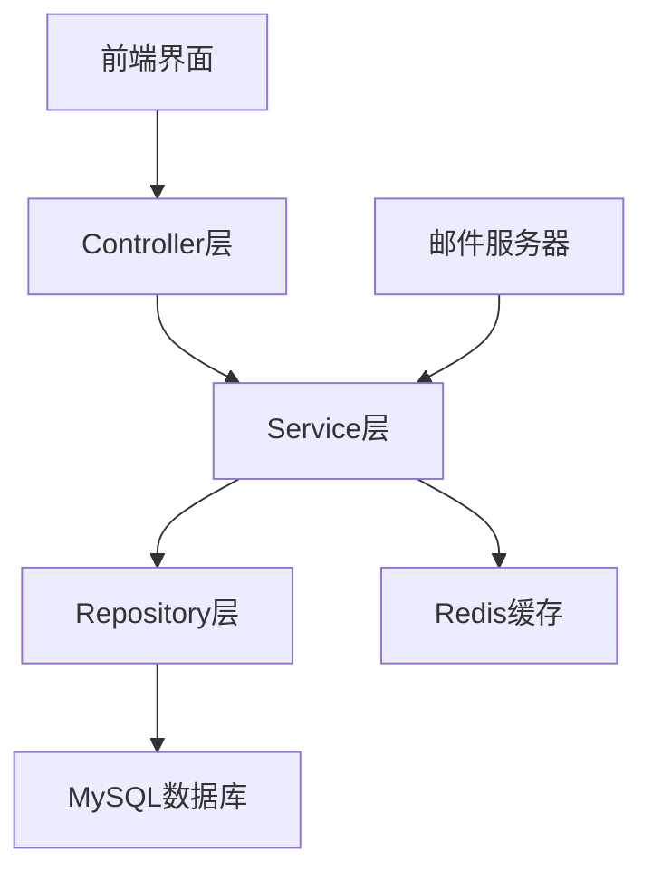

# 🖥️ 实验室管理系统 (LabMS)

<p align="center">
  
  
  
</p>

> 基于Spring Boot开发的现代化高校计算机实验室资源管理系统，提供用户管理、座位预约、课程安排等一体化解决方案。

## ✨ 核心功能

### 👤 用户管理系统
- **多角色权限控制** - 学生、教师、管理员三种角色各司其职
- **安全认证体系** - JWT Token身份验证，保障系统安全
- **个人信息维护** - 手机号、邮箱等信息随时更新
- **密码安全管理** - 通过邮箱验证码验证的密码修改机制

### 💺 智能预约系统
- **灵活预约方式** - 支持单个座位预约或整个实验室预约
- **实时状态查看** - 座位占用情况一目了然
- **预约记录追踪** - 个人预约历史完整保留
- **便捷取消机制** - 随时取消未到时间的预约

### 📚 课程与实验室管理
- **课程信息维护** - 课程基本信息管理
- **可视化课表** - 直观展示课程时间安排
- **学期周期管理** - 支持不同学期的数据隔离

## 🛠 技术架构

### 后端技术栈
| 类别 | 技术选型 |
|------|---------|
| 核心框架 | Spring Boot 3.5.7 |
| 安全框架 | Spring Security + JWT |
| 数据持久化 | Spring Data JPA + Hibernate |
| 缓存数据库 | Redis |
| 关系数据库 | MySQL 8.x |
| 邮件服务 | JavaMailSender |

### 系统架构图


## ⚙️ 环境配置

### 数据库配置
```properties
spring.datasource.url=jdbc:mysql://服务器地址:3306/labms?useSSL=false&serverTimezone=UTC&allowPublicKeyRetrieval=true
spring.datasource.username=用户名
spring.datasource.password=密码
spring.datasource.driver-class-name=com.mysql.cj.jdbc.Driver
spring.jpa.hibernate.ddl-auto=update
```
- **服务器地址：** 192.168.31.44
- **用户名：** 192.168.31.44
- **密码：** 123456

### 邮件服务配置
```properties
spring.mail.host=smtp.qq.com
spring.mail.port=587
spring.mail.username=邮箱账号
spring.mail.password=授权码
spring.mail.properties.mail.smtp.auth=true
spring.mail.properties.mail.smtp.starttls.enable=true
```
- **邮箱账号：** labms@qq.com
- **授权码：** dhpbqiaxtlxsdfah

### Redis配置
```properties
spring.data.redis.host=Redis服务器地址
spring.data.redis.port=6379
spring.data.redis.password=密码
```
- **Redis服务器地址：** 192.168.31.44
- **密码：** 123456

## 📡 核心API接口

### 🔐 认证授权接口
```bash
# 用户登录
POST /api/student/login    # 学生登录
POST /api/teacher/login    # 教师登录
POST /api/admin/login      # 管理员登录
```

### 👥 用户管理接口
```bash
GET  /api/users              # 获取所有用户信息
POST /api/user/add_student   # 添加学生用户
POST /api/user/update        # 更新用户信息
POST /api/user/update_password  # 修改密码
DELETE /api/user/delete_student # 删除学生
```

### 🪑 座位预约接口
```bash
GET  /api/reservations           # 查询指定实验室预约信息
GET  /api/reservations/user      # 查询用户预约记录
POST /api/reservations           # 创建新预约
DELETE /api/reservations         # 取消预约
```

### 💾 座位状态接口
```bash
GET /api/seats/status    # 获取座位状态
PUT /api/seats/status    # 更新座位状态
```

## 🚀 快速部署

1. **环境准备**
   ```bash
   # 确认Java版本
   java -version  # 需要Java 17+
   
   # 确认Maven可用
   mvn -v
   ```

2. **数据库初始化**
   ```sql
   CREATE DATABASE labms CHARACTER SET utf8mb4 COLLATE utf8mb4_unicode_ci;
   ```

3. **项目构建**
   ```bash
   # 克隆项目
   git clone [项目地址]
   
   # 进入项目目录
   cd labms
   
   # Maven清理并打包
   mvn clean package
   ```

4. **运行应用**
   ```bash
   java -jar target/labms-0.0.1-SNAPSHOT.jar
   ```
   ```bash
   mvn spring-boot:run
   ```

## 🔒 安全机制

- **JWT令牌认证** - 无状态的身份验证机制
- **密码加密存储** - 使用高强度加密算法保护用户密码
- **权限分级控制** - 不同角色拥有不同的操作权限
- **邮箱验证机制** - 关键操作需要邮箱验证码确认
- **SQL注入防护** - 使用JPA防止常见安全漏洞

## 📄 项目结构

```
labms/
├── src/main/java/org/example/labms/
│   ├── config/          # 配置类
│   ├── controller/      # 控制器层
│   ├── dto/             # 数据传输对象
│   ├── model/           # 实体模型
│   ├── repository/      # 数据访问层
│   ├── service/         # 业务逻辑层
│   ├── util/            # 工具类
│   └── LabmsApplication.java  # 启动类
└── src/main/resources/
    ├── application.properties  # 配置文件
    └── ...
```

## 👥 开发团队

本系统由JavaWeb第16小组开发团队打造，致力于提升高校实验室资源利用率和管理水平。

## 📃 许可声明

本项目仅供学习交流使用。